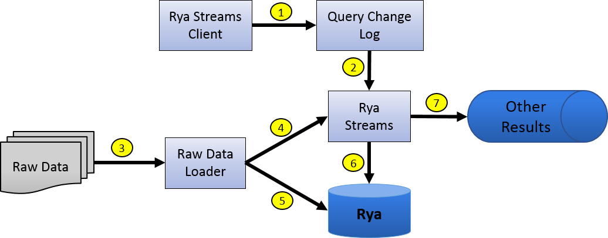

<!--
[comment]: # Licensed to the Apache Software Foundation (ASF) under one
[comment]: # or more contributor license agreements.  See the NOTICE file
[comment]: # distributed with this work for additional information
[comment]: # regarding copyright ownership.  The ASF licenses this file
[comment]: # to you under the Apache License, Version 2.0 (the
[comment]: # "License"); you may not use this file except in compliance
[comment]: # with the License.  You may obtain a copy of the License at
[comment]: # 
[comment]: #   http://www.apache.org/licenses/LICENSE-2.0
[comment]: # 
[comment]: # Unless required by applicable law or agreed to in writing,
[comment]: # software distributed under the License is distributed on an
[comment]: # "AS IS" BASIS, WITHOUT WARRANTIES OR CONDITIONS OF ANY
[comment]: # KIND, either express or implied.  See the License for the
[comment]: # specific language governing permissions and limitations
[comment]: # under the License.
-->

# Rya Streams

Introduced in 3.2.13

## Disclaimer
This is a Beta feature. We do not guarantee newer versions of Rya Streams
will be compatible with this version. You may need to remove all of your
queries and their associated data from your Rya Streams system and then 
reprocess them using the upgraded system.

# Table of Contents
- [Introduction](#introduction)
- [Architecture](#architecture)
- [Quick Start](#quick-start)
- [Use Cases](#use-cases)
- [Future Work](#future-work)

<div id='introduction'/>

## Introduction 
Rya Streams is a system that processes SPARQL queries over streams of RDF
Statements that may have Visibilities attached to them. It does this by
utilizing Kafka as a data processing platform.

There are three basic building blocks that the system depends on:

* **Streams Query** - This is a SPARQL query that is registered with Rya Streams.
  It is associated with a specific Rya instance because that Rya instance
  determines which Statements the query will evaluate. It has an ID that
  uniquely identifies it across all of the queries that are managed by the
  system, whether or not the system should be processing it, and whether or not
  the results of the query needs to be inserted back into the Rya instance the
  source statements come from.
  
* **Query Change Log** - A list of changes that have been performed to the
  Streams Queries of a specific Rya Instance. This log contains the absolute
  truth about what queries are registered, which are running, and which generates
  new statements that need to be inserted back into Rya.

* **Query Manager** - A daemon application that reacts to new/deleted Query
  Change Logs as well as new entries within those logs. It starts and stops
  Kafka Streams processing jobs for the active Streams Queries.

The [Quick Start](#quick-start) section explains how the Rya Streams Client is
used to interact with the system using a simple SPARQL query and some sample
Statements.

<div id='architecture'/>

## Architecture ##

The following image is a high level view of how Rya Streams interacts with
Rya to process queries.



1. The Rya Streams client is used to register/update/delete queries.
2. Rya Streams notices the change and starts/stops processing a query based on
   what the change was.
3. Statements are discovered for ingest by whatever application is loading data
   into Rya.
4. Those Statements are written to Rya Streams so that the Streams Queries may
   process them and produce results.
5. Those Statements are also written to the Rya instance for ad-hoc querying.
6. Rya Streams produces Visibility Binding Sets and/or Visibility Statements
   that are written back to Rya.
7. Those same Visibility Binding Sets and/or Visibility Statements are made
   available to other systems as well.

<div id='quick-start'/>

## Quick Start ##
This tutorial demonstrates how to install and start the Rya Streams system. It
must be configured and running on its own before any Rya instances may use it.
After performing the steps of this quick start, you will have installed the
system, demonstrated that it is functioning properly, and then may use the Rya
Shell to configure Rya instances to use it.  
 
This tutorial assumes you are starting fresh and have no existing Kafka, or
Zookeeper data. The two services must already be installed and running.

### Step 1: Download the applications ###

You can fetch the artifacts you need to follow this Quick Start from our
[downloads page](http://rya.apache.org/download/). Click on the release of
interest and follow the "Central repository for Maven and other dependency
managers" URL.

Fetch the following two artifacts:

Artifact Id | Type 
--- | ---
rya.streams.client | shaded jar
rya.streams.query-manager | rpm

### Step 2: Install the Query Manager ###

Copy the RPM to the CentOS 7 machine the Query Manager will be installed on.
Install it using the following command:

```
yum install -y rya.streams.query-manager-3.2.12-incubating.noarch.rpm
```

It will install the program to **/opt/rya-streams-query-manager-3.2.12**. Follow
the directions that are in the README.txt file within that directory to finish
configuration.

### Step 3: Register a Streams Query with Rya Streams ###

Use the Rya Streams Client to register the following Streams Query:

```
SELECT * 
WHERE { 
    ?person <urn:talksTo> ?employee .
    ?employee <urn:worksAt> ?business
}
```
We assume Kafka is running on the local machine using the standard Kafka port
of 9092. Issue the following command:

```
java -jar rya.streams.client-3.2.12-incubating-SNAPSHOT-shaded.jar add-query \
    -i localhost -p 9092 -r rya-streams-quick-start -a true \
    -q "SELECT * WHERE { ?person <urn:talksTo> ?employee .?employee <urn:worksAt> ?business }"
```
The Query Manager should eventually see that this query was registered and
start a Rya Streams job that will begin processing it using any Visibility
Statements that have been loaded into Rya Streams. If no results are observed
in step 6, then verify the Query Manager is working properly. Its logs can be
found in **/opt/rya-streams-query-manager-3.2.12/logs**.

### Step 4: Start watching for results ###

We need to fetch the Query ID of the query we want to watch. This can be looked
up by issuing the following command:

```
java -jar rya.streams.client-3.2.12-incubating-SNAPSHOT-shaded.jar list-queries \
    -i localhost -p 9092 -r rya-streams-quick-start"
```

The client will print something that looks like this:

```
Queries in Rya Streams:
---------------------------------------------------------
ID: 8dd689ee-9d16-4aa7-91c0-667cdb3ed81a    Is Active: true     Query: SELECT * WHERE { ?person <urn:talksTo> ?employee .?employee <urn:worksAt> ?business }
```

Now we know that if we want to reference the query we registered in step 3, we
need to use the Query ID **8dd689ee-9d16-4aa7-91c0-667cdb3ed81a**. Start
watching the Stream Query's output using the following command:

```
java -jar rya.streams.client-3.2.12-incubating-SNAPSHOT-shaded.jar stream-results \
    -i localhost -p 9092 -r rya-streams-quick-start" -q 8dd689ee-9d16-4aa7-91c0-667cdb3ed81a
```

The command will not finish. The console will print results once they are produced
by the Rya Streams job that is processing the query. Results will appear once
Statements have been loaded.

### Step 5: Load data into the input topic ###

In a new terminal, create a file named **quick-start-data.nt** that contains
the following text: 

```
<urn:Bob> <urn:worksAt> <urn:TacoPlace> .
<urn:Charlie> <urn:worksAt> <urn:BurgerJoint> .
<urn:Eve> <urn:worksAt> <urn:CoffeeShop> .
<urn:Bob> <urn:worksAt> <urn:BurgerJoint> .
<urn:Alice> <urn:talksTo> <urn:Bob> .
```
For the sake of simplicity within this quick start, we aren't going to use
visibilities when we load the statements. Load the file using the following
command:

```
java -jar rya.streams.client-3.2.12-incubating-SNAPSHOT-shaded.jar load-statements \
    -i localhost -p 9092 -r rya-streams-quick-start" -v "" -f ./quick-start-data.nt
```

### Step 6: Observe the results that appear ###

Go back to the terminal that was listening for results. The following results
will have appeared: 

```
  names: 
    [name]: person  ---  [value]: urn:Alice
    [name]: employee  ---  [value]: urn:Bob
    [name]: business  ---  [value]: urn:BurgerJoint
  Visibility: 

  names: 
    [name]: person  ---  [value]: urn:Alice
    [name]: employee  ---  [value]: urn:Bob
    [name]: business  ---  [value]: urn:TacoPlace
  Visibility: 
```

<div id='use-cases'/>

## Use Cases ##
### Alerting ###
An alerting system's job is to notify people, or another application, when 
something of interest has been observed. Alert latency is the amount of time
it takes for a system to issue the alert after the observations required to do
so have been made. How the alerts are used determines how much latency is able
to be tolerated. For example, if the alerting system is used to discover when a
fire has started in a building, then that latency period needs to be short in
order to save the building. However, some systems do not require low latency.
Status updates typically aren't time critical. An alert that your package has
been shipped doesn't need to be timely since your package still hasn't arrived.

Rya Streams is able to be used to build alerting systems. The conditions that 
generate alerts are encapsulated within a SPARQL query, the observations that
are watched are the RDF Statements, and the alert is a Binding Set or
constructed Statement that is output by the query. It being low/high latency
will depend on how much data needs to be processed and how performant the
alerting queries are.

### Inference Engine - Forward Chaining ###

An inference engine that uses forward chaining starts with a set of inference
rules and some data. It uses the rules to generate new data until it reasons
its way to some end goal/answer. For example, suppose that the goal is to
conclude the color of a pet named Fritz, given that he croaks and eats flies,
and that the rule base contains the following four rules:

 1. If X croaks and X eat flies - Then X is a frog
 2. If X chirps and X sings - Then X is a canary
 3. If X is a frog - Then X is green
 4. if X is a canary - Then X is yellow

If the following two facts are evaluated using this rule set:
* Fritz croaks
* Fritz eats flies

Then the following facts are inferred about Fritz:
* Fritz is a frog
* Fritz is green

Rya Streams is able to be used to build an inference engine that executes that
rule set. SPARQL queries are used to generate new Statements from the original
set of Statements. For example:

```
INSERT {
    ?x a <urn:frog>
} WHERE {
    ?x <urn:makesSound> <urn:croaks> .
    ?x <urn:eats> <urn:flies> .
}

INSERT {
    ?x <urn:hasColor> <urn:green>
} WHERE {
    ?x a <urn:frog>
}
```
As long as the first query's results are ingested into the streams application,
the second query will infer that ?x is green based on the previous query's
inferred statement. 

### PCJ Maintenance ###

Pre-Computed Joins are a feature within Rya where a query's results are
maintained and used as an index to speed up query evaluation. See the
[PCJ section](pcj-updater.md) of the manual for more information about the
specifics of how that index works.

Rya Streams is able to create the Visibility Binding Sets that need to be loaded
into the PCJ index. It just needs to see the same Statements that the core Rya
instance has been loaded with.

<div id='future-work'/>

## Future Work ##
Each of the following subsections cover an improvement that could be made to
the Rya Streams system. These improvements would push this feature towards a
production ready state.

### Historic Statement Processing ###
As currently implemented, a program needs to write new Statements to the core
Rya data store as well as the input topic for Rya Streams. Every time a query
is added to Rya Streams for processing, it will only see newly added Statements.
We could write a Kafka Connect Rya source that imports historic data into the
statements topic so that it, too, will be processed.

### PCJ Maintenance ###
The Rya Streams system is capable of creating PCJ results over streamed
statements, but there isn't anything written to import those results from the
QueryResult topic into the source Rya's PCJ index. We could use Kakfa Connect
to write those binding sets into the index.

### Query Manager Durability ###
The Query Manager daemon is a single point of failure for this system. If it
is not running, then queries can not be processed. This problem could be
solved in a few different ways depending on the size of the deployed system.
If multiple machines are available, but only a small amount of data/number of
queries need to be processed, then failing over to a secondary Query Manager
would work fine. If a cluster solution is being used, then the Query Manager
could be refactored to run in something like YARN. It then becomes the
cluster's responsibility to start up processing on a new machine when the
application dies.

### Query Change Log Reverse Compatibility ###
We use Java Serialization to write `ChangeLogEntry<QueryChange>` objects to the
KafkaQueryChangeLog. This will cause problems if the schema of that object is
updated between versions. A serialization framework (Avro, Protobuf, etc) that
supports reverse compatible models needs to be used instead to move this feature
out of Beta.

### Exactly Once Kafka Streams Processing ###
The version of Kafka that we are using for this system does not guarantee
exactly once execution within Kafka Streams. It only guarantees at least once
execution. This means a query may process the same statement more than once.
If this happens, then repeat results may be written to the query's results
topic. Kafka 1.0.0+, however, does support exactly once execution. Upgrading
Kafka would allow us to fix this problem.

### Query Processing Scalability ###
The Query Manager executes all query topologies with a single thread per query 
on the same JVM. We suspect this will only work well when there are a limited 
number of queries that need to be processed and all of those queries don't need
to process a large volume of statements.

Kafka Streams usually scales out by copying the processing topology to many
machines who do the same processing, but over different hunks of work that need
to be processed. Each streams worker handles a subset of the topic's partitions.
This works great so long as all data that is required to process the worker's
portion of the processing is located within a single partition of the topic.
However, erroneous results will be computed if something is missed because a
different streams worker had a piece of data that was required to reach the
correct result.

Here's an example that illustrates that problem.

Suppose you want your Kafka Streams topology to count the number of times
each word appears within the input topic. The topic has two partitions and
data is written to those partitions without ensuring the same words always go
to the same positions. The topic could look like this:  
Partition 1: {apple}, {apple}, {bread}  
Partition 2: {eggs}, {apple}, {eggs}  

Two copies of the topology are executed where each copy handles one of the
partitions. The following results would be written to the the results topic:  
{apple, 2}, {bread, 1}, {eggs, 2}, {apple, 1}

Both streams jobs end up counting different portions of the "apples", so you
get two results for apples. Had all "apples" gone to a single partition, then
a single streams worker would have counted all of them, and {apples, 3} would
have been written a single time.  

The same problem effects how we process SPARQL queries within Rya Streams. If
each streams worker processes the entire topology, then you need to make sure
each job handles all Statements that result in Binding Sets who join within
the query. There isn't a way to partition the data at the statement level, so
we would need to break the queries into many Kafka Streams topologies. A single
Join node could be the entire topology where the input topic contains binding
sets that are emited from the left and right child. So long as which partition
the data is written to is based on a hash over the values of the join variables,
then each worker will only receive data that is able to be joined.