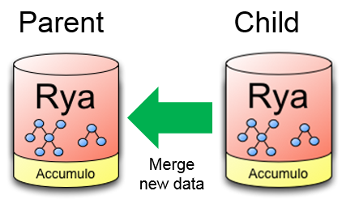
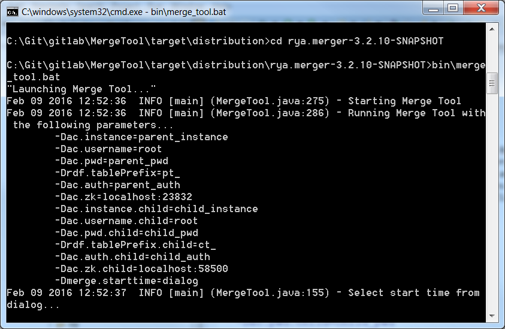
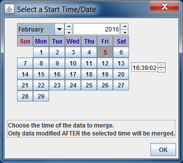
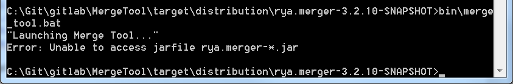

<!-- Licensed to the Apache Software Foundation (ASF) under one
or more contributor license agreements.  See the NOTICE file
distributed with this work for additional information
regarding copyright ownership.  The ASF licenses this file
to you under the Apache License, Version 2.0 (the
"License"); you may not use this file except in compliance
with the License.  You may obtain a copy of the License at

  http://www.apache.org/licenses/LICENSE-2.0

Unless required by applicable law or agreed to in writing,
software distributed under the License is distributed on an
"AS IS" BASIS, WITHOUT WARRANTIES OR CONDITIONS OF ANY
KIND, either express or implied.  See the License for the
specific language governing permissions and limitations
under the License. -->

# Accumulo to Accumulo Cloning

___

## Purpose

Merge Tool is a java application to merge a child's Accumulo instance to its parent instance after the child has collected/modified its data set.



## Overview

At deployment time, a child instance of an Accumulo instance will be created and sent out where its users will create, modify, and delete data.  This data from the child will then need to be synched with its parent after deployment.  By default, the data only needs to be handled at the Accumulo level and so will not need to know the logical consistency of the higher level models it's storing (i.e. Rya logic).  Alternatively, if higher-level rules are desired, a SPARQL query can be used to define a subset of data to copy.  Some decisions that were made about the tool:

  * When merging, the data is going only ONE way: the child is reintegrating its new data with the parent Accumulo instance (the parent does NOT have to merge its new data into the child).

  * Since an update to a row value is just a delete followed by an add, row value updates aren't needed.

  * Special care must be taken when there's a difference between the parent's and child's column visibility in the same row.  In this case, the two visibility values should be OR'ed together to produce the new visibility value to use.

  * The tool should be extended to only merge data from after a specific time (start time).  This will merge in a smaller subset of data modifications from the child to the parent.

## Merge Tool Process

The Merge Tool can be ran through the command line to look through a child instance and merge its data over to the parent instance.  The command line will make calls to a jar containing the tool and execute the job.  This will also allow extra config parameters (such as the location of the parent and child instance) to be used when called.

## Copy Tool Process

The Copy Tool is used to create a child instance from a parent instance.  The user can select a time for the data to be included so only data coming after that time is replicated, and/or can provide a query so that only statements potentially relevant to that query will be replicated.  The tool is run from the command line using the same jar as the Merge Tool.

### Rule-based Copy

A SPARQL query can be used to provide RDF-level rules about which statements to copy. The tool will extract a set of simple rules from an arbitrary query by
breaking the query down into its constituent statement patterns and filter expressions. A rule then consists of a single statement pattern (subject,
predicate, and object, where some of these can be variables) and an optional boolean function (any filter from the original query that applies to the variables
in the statement pattern). Any statement that matches any one of the rules patterns will be copied from the parent to the child. Not every matching statement
will be part of a solution to the complete query, but all of the rules together will guarantee that any solution that exists in the parent will also exist
in the child after running the Copy Tool.

For example, the query:
```sparql
SELECT * WHERE {
    ?x rdf:type :Person .
    ?x :name ?name .
    FILTER regex(?name, "^A") .
}
```
will resolve to two rules:

  * `?x rdf:type :Person` becomes: Copy every statement stating that any resource has `rdf:type` of `:Person` .

  * `?x :name ?name`, combined with the filter, becomes: Copy every statement with predicate `:name` whose object matches the regular expression `^A` .

Note that the rules are now independent -- the original query joins the two statement patterns on `?x`, but this is not considered in the copy process. This
means, for example, that type assignments of `:Person` will be copied even if the individuals don't have names and therefore wouldn't be solutions to this query,
but that if `:name` statements are later inserted, new solutions may be found.

In general, if the child is copied from the parent according to query `q`, then adding arbitrary instance data `D` to the child and evaluating `q` against
the child will yield the same solutions as would adding `D` to the parent and evaluating `q` against the parent.

The independence of rules also means that the query cannot contain any statement pattern consisting of only variables, since this would resolve to a rule that would match all statements.

Rya's inference engine can be used to automatically expand queries according to inference logic before decomposing into rules. This can be configured using the standard
configuration variables governing inference. If necessary, additional rules will be added to include any schema information (relevant subClassOf statements etc.) that was
used to expand the query.

## Implementation Details

The Copy Tool should be run on the machine where the child instance will be stored.  The Copy Tool uses a TimestampFilter iterator setting to only include the data that fits the time range. This time criteria is added to the input format for the Copy Tool's MapReduce job. The MapReduce job then writes out the key/value pairs it has in its context to the child table using a BatchWriter. The MapReduce job also checks a parent's authorization list so they can be copied to the child user. A separate MapReduce job is run for each table being copied until all tables are done.

By default the tool will copy all the tables from the parent but it can be configured to only copy a smaller subset.  Using a comma-separated list, add/modify the `copy.table.list` property in the config with the names of the parent tables to copy.

If configured to use a query to select data, the Copy Tool instead divides that query into independent rules, determines where to find matching statements in the parent tables, and launches a single MapReduce job with only a Map phase. Each mapper scans a portion of the parent data associated with a rule (using AccumuloMultiTableInputFormat to specify tables and ranges), and inserts the matching statements into the child Rya instance. Since this mode operates at the statement level instead of the row level, specifying individual tables to copy has no effect. The child's spo, osp, and po tables will always be populated with the matching statements, the namespace table will be copied directly, and secondary indexers will be used to index data in the child if they are enabled in the configuration.

The Merge Tool utilizes a MapReduce job to handle the processing of data.  It is implemented using Java with two Scanners running together to compare the parent/child Accumulo instances.  Since both Scanners will return sorted data, if the two key-values are equal, then both Scanners can advance to the next comparison.  If the Key from Scanner1 sorts before the Key from Scanner2, then that Key doesn't exist in the table from Scanner2 which means Scanner1 should advance. If the Key from Scanner2 sorts before the Key from Scanner1, then that Key doesn't exist in the table from Scanner1 which means Scanner2 should advance.

If a key is found in the parent that doesn't exist in the child instance then we need to determine whether it was added by the parent or deleted by the child. If the timestamp is before the start time then the child deleted the key and the parent should delete the key as well. If the timestamp is after the start time then the parent added it and the key should remain. Similar time comparisons are applied to if a key exists in the child instance but not the parent.

### Merge Logic

**Parent:** Original Rya repository.  Ignore modifications.  
**Child:** Rya repository that was copied from parent then modified.  
**older, newer:** Statement timestamp is older/newer than specified merge time (start time).  
**missing:** Statement is absent from the repository.  

| **case** | **Parent** | **Child** | **assume that** | **merge modification** | **in parent after** |
|----------|------------|-----------|-----------------|------------------------|---------------------|
| 1        | older      | missing   | child deleted   | delete from parent     | no                  |
| 2        | newer      | missing   | parent added    | do nothing             | yes                 |
| 3        | missing    | older     | parent deleted  | do nothing             | no                  |
| 4        | missing    | newer     | child added     | add to parent          | yes                 |
| 5x       | older      | older     | same key        | do nothing             | yes                 |
| 6x       | newer      | newer     | same key        | do nothing             | yes                 |
| 7\*      | older      | newer     | child updated   | do cases 1 and 4       | yes                 |
| 8\*      | newer      | older     | parent updated  | do cases 2 and 3       | yes                 |

NOTE:

**x** - The two cases having the same key and timestamp are already merged.

**\*** - The last two cases are really two distinct keys, since the timestamp is part of the Accumulo key. They are handled as two comparisons. They are different versions of the same key, but Rya is generally used with only the latest version.

Here it is again, in full English:

1.  If the parent statement exists, child doesn't, and parent time-stamp is before the start time, assume child statement was deleted, so delete the parent statement.

2.  If the parent statement exists, child doesn't, and parent time-stamp is after the start time, assume parent statement was added, so do nothing.

3.  If the child statement exists, parent doesn't, and child time-stamp is before the start time, assume parent statement was deleted, so do nothing.

4.  If the child statement exists, parent doesn't, and child time-stamp is after the start time, assume child statement was added, so add the statement to the parent.

## Instructions

### Prerequisites

If you are building on Windows, you will need hadoop-common 2.6.0's *"winutils.exe"* and *"hadoop.dll"*. You can download it from [here](https://github.com/amihalik/hadoop-common-2.6.0-bin/archive/master.zip).

Environment variables for `ACCUMULO_HOME` and `HADOOP_HOME` need to be set.

#### Accumulo Home variable:

You'll need to set an environment variable for `ACCUMULO_HOME`. (at least for Windows) It does not need to exist, but it must be an absolute path.

`set ACCUMULO_HOME=C:\share\accumulo-1.6.4`

It uses this to find extra jar's: "$ACCUMULO\_HOME/lib/ext/\[^.\].\*.jar" If this variable is empty, or if it is a relative path, it will produce this error:

`Could not find file with URI "/lib/ext/[^.].*.jar" because it is a relative path, and no base URI was provided.`

#### Hadoop Home variable:

You'll need to set an environment variable for `HADOOP_HOME`.

`set HADOOP_HOME=C:\hadoop-common-2.6.0-bin-master`
`set PATH=%PATH%;%HADOOP_HOME%\bin`

### Building

To build the Merge Tool (Copy Tool will be built along with it), use a command prompt and go to and the *"MergeTool"* directory that was cloned from Git. From there do:

`mvn clean install –Drat.skip=true`

(The `-Drat.skip=true` flag is to skip license tests. `-DskipTests` can be used to skip the unit tests.)

This will create a distribution folder which can be found in *“MergeTool/target/distribution/rya.merger-{version.number}”* and also a single zip file which contains the distribution in *“MergeTool/target/rya.merger-{version.number}-bundle.zip”*. Take the distribution folder or zip and install to whatever location is desired. This location will be referred to as *"{merge-tool-install-directory}"* from here on.

### Configuring

Merge Tool and Copy Tool need configuration information from both the parent and child accumulo instances in order to connect to them. They will need the following values for both the parent and child:

  * Instance Name
  * Username
  * Password
  * Table Prefix
  * Authorization List (comma-separated list)
  * ZooKeeper Hosts List (comma-separated list of ZooKeeper host[:port]s)
  * [Optional] Start Time (this will merge only data that was modified, inserted, or deleted after this time. Specify `"dialog"` to bring up a calendar/time window to pick the date and time. If the exact time/date is known and the dialog is not desired then the value must be formatted like `"yyyyMMddHHmmssSSSz"` so `"February 4th, 2016 1:45:23 PM EST"` would be `"20160204134523000EST"` without the quotes)

Ensure the parent and child accumulo instances are running because we’ll need information from them to connect to each instance. First open *“{merge-tool-install-directory}/config/configuration.xml”* for Merge Tool or *“{merge-tool-install-directory}/config/copy_tool_configuration.xml”* for Copy Tool in an editor. Inside we need to configure the part that looks like the below section:

```xml
    <configuration>
        <property>
            <name>ac.instance</name>
            <value>parent_instance</value>
        </property>
        <property>
            <name>ac.username</name>
            <value>root</value>
        </property>
        <property>
            <name>ac.pwd</name>
            <value>parent_pwd</value>
        </property>
        <property>
            <name>rdf.tablePrefix</name>
            <value>pt_</value>
        </property>
        <property>
            <name>ac.auth</name>
            <value>parent_auth</value>
        </property>
        <property>
            <name>ac.zk</name>
            <value>localhost:1111</value>
        </property>
        <property>
            <name>ac.instance.child</name>
            <value>child_instance</value>
        </property>
        <property>
            <name>ac.username.child</name>
            <value>root</value>
        </property>
        <property>
            <name>ac.pwd.child</name>
            <value>child_pwd</value>
        </property>
        <property>
            <name>rdf.tablePrefix.child</name>
            <value>ct_</value>
        </property>
        <property>
            <name>ac.auth.child</name>
            <value>child_auth</value>
        </property>
        <property>
            <name>ac.zk.child</name>
            <value>localhost:2222</value>
        </property>
        <property>
            <name>tool.start.time</name>
            <value>dialog</value>
        </property>
    </configuration>
```

### Running

The Merge Tool (and Copy Tool) can be run or tested several ways. Either connect to a real Accumulo cluster or to a MiniAccumulo test cluster running in Eclipse. Both clusters can be connected to by any of the following methods which will described more thoroughly below:

  * Running from the script file *"merge_tool.bat"* or *"merge_tool.sh*" to call the MergeTool jar
  * Running in Eclipse with *"MergeTool.java"*
  * Running with the Maven `"exec"` command

#### Starting the MiniAccumulo Test Cluster

This is for testing and creates a MiniAccumuloCluster that the Merge Tool can connect to.

In Eclipse, right-click on *“/rya.merger/src/test/java/org.apache/rya/accumulo/mr/merge/driver/MiniAccumuloClusterDriver.java”* and choose *"Run -> Java Application"*. If it successfully starts, it will say `“MiniAccumuloClusters running and populated”` at the bottom of the console. With the MiniAccumuloClusterDriver running in Eclipse, edit the *"merge_tool.bat"* or *"merge_tool.sh"* script using the parent and child config values displayed in the *"MiniAccumuloClusterDriver"* console (scroll up in the console to find and copy the values you need). Save the script file and run it as described below.

#### Running from the Script File

Once the distribution has been installed and configured (see the section above on configuring the script files), use the command prompt to navigate to the *“{merge-tool-install-directory}"*. From there run:

For Merge Tool on Windows:

`bin/merge_tool.bat`

For Merge Tool on Linux:

`./bin/merge_tool.sh`

For Copy Tool on Windows:

`bin/copy_tool.bat`

For Copy Tool on Linux:

`./bin/copy_tool.sh`

#### Running in Eclipse

With the *"MiniAccumuloClusterDriver"* or a regular Accumulo cluster running, open *“/rya.merger/config/configuration.xml”* for Merge Tool or *“/rya.merger/config/copy_tool_configuration.xml”* for Copy Tool. Edit the config values with the ones provided in the console of the *"MiniAccumuloClusterDriver"* which should look something like:

```
-Dac.instance=parent_instance
-Dac.username=root
-Dac.pwd=parent_pwd
-Drdf.tablePrefix=pt_
-Dac.auth=parent_auth
-Dac.zk=localhost:1111
-Dac.instance.child=child_instance
-Dac.username.child=root
-Dac.pwd.child=child_pwd
-Drdf.tablePrefix.child=ct_
-Dac.auth.child=child_auth
-Dac.zk.child=localhost:2222
```

The first line (`-Dac.instance=parent_instance`) corresponds to the XML section:

```xml
    <property>
        <name>ac.instance</name>
        <value>parent_instance</value>
    </property>
```

Only modify the inside of a property's `<value>...</value>` tag when configuring. Once configured, right-click on *“/rya.merger/src/main/java/org.apache/rya/accumulo/mr/merge/MergeTool.java”* and choose *“Run As -> Run Configurations...”*. Click on the *“Arguments”* tab and in the *“VM arguments”* box add the value:

```
    -Dlog4j.configuration="file:config/log4j.xml"
```

In the *"Program arguments"* box add the value:

```
    -conf config/configuration.xml
```

For the Copy Tool, do the same thing for *“/rya.merger/src/main/java/org.apache/rya/accumulo/mr/merge/CopyTool.java” but change the arguments to:

```
    -Dlog4j.configuration="file:config/copy_tool_log4j.xml"
    -conf config/copy_tool_configuration.xml
```

Once the values are copied in, hit the *"Run"* button at the bottom.

#### Running with the Maven "exec" Command

Open *"MergeTool/config/configuration.xml"*, and modify the values to connect to each instance. Once done, save the file.

Using a command prompt, navigate to the *"MergeTool"* folder. From there run:

`mvn exec:java@MergeTool -Drat.skip=true`

Similarly, for the Copy Tool, configure *"MergeTool/config/copy_tool_configuration.xml"* and run:

`mvn exec:java@CopyTool -Drat.skip=true`

#### Using Merge Tool

When the Merge Tool has launched it should output the config values it has started up with such as below: (make sure they are correct for the instances you are connecting to)



If `"dialog"` was specified for `"-Dtool.start.time"`, then the following prompt will show up: (modifications made by the child instance after the start time will be merged back into the parent instance)



If the following statement appears after starting the Merge Tool, then edit the *"bin/merge_tool.bat"* script and change *"rya.merger-\*.jar"* to the full name of the jar which should be *"rya.merger-{version.number}.jar"* where *"{version.number}"* is the actual version attached to Merge Tool jar such as *"3.2.10-SNAPSHOT"*. Save the file and try re-running the script. The error should only happen in some versions of Windows.



After the start time is selected, the Merge Tool will display the line *"Will merge all data after {date.selected}"* in the console followed by *"Job for table {spo.table.name} started: {time}"*. This will create a MapReduce job to merge the child data into the parent instance. The length of time it takes to complete depends on the sizes of the parent and child instances.

After it has finished, the MapReduce job will display some statistics and show that the job has finished as seen below:


If there were any errors, they should be displayed in the console. To look up any previous errors (if the console closes or for support), the logs can be checked. They are located in *“{merge-tool-install-directory}/log”*. There are two log files: one displays all information from a run and the other displays only error messages.

#### Using Copy Tool

Copy Tool is used in the same manner as Merge Tool but its config is found in *"{merge-tool-install-directory}/config/copy_tool_configuration.xml"* and its scripts are *"bin/copy_tool.bat"* and *"bin/copy_tool.sh"*.

##### Using File Output with Copy Tool

To have the Copy Tool output its data to a local directory, set the `use.copy.file.output` configuration option value to `true` in *"{merge-tool-install-directory}/config/copy_tool_configuration.xml"*. Also, specify in the configuration where it should be stored in the `copy.file.output.path` option. The recommended compression for the `copy.file.output.compression.type` option is `gz`. An example of the configuration values is shown below:

```xml
    <property>
        <name>use.copy.file.output</name>
        <value>true</value>
    </property>
    <property>
        <name>copy.file.output.path</name>
        <value>/tmp/copy_tool_file_output/</value>
    </property>
    <property>
        <name>copy.file.output.compression.type</name>
        <value>gz</value>
    </property>
```

##### Using Query-based Rules with Copy Tool

To have the Copy Tool select data according to a SPARQL query, set `use.copy.query.sparql` to `true` in *"{merge-tool-install-directory}/config/copy_tool_configuration.xml"*. Provide the query using either `ac.copy.queryfile` with the path to a text file
containing the query, or `ac.copy.query` with the text of the query itself. Set Rya options related to indexing (e.g. `sc.use_temporal`) and inference (e.g. `query.infer`) as desired.

```xml
    <property>
        <name>use.copy.query.sparql</name>
        <value>true</value>
    </property>
    <property>
        <name>ac.copy.queryfile</name>
        <value>/path/to/query.sparql</value>
    </property>
    <property>
        <name>ac.copy.query</name>
        <value>
            PREFIX test: &lt;http://example.com#&gt;
            PREFIX rdf: &lt;http://www.w3.org/1999/02/22-rdf-syntax-ns#&gt;
            SELECT * {
                ?x rdf:type test:Person .
                ?x test:name ?name .
            }
        </value>
    </property>
    <property>
        <name>sc.use_temporal</name>
        <value>true</value>
    </property>
    <property>
        <name>query.infer</name>
        <value>true</value>
    </property>
```

##### Importing a directory with Copy Tool

If the File Output option was used with the Copy Tool then the generated directory can be used to import the data into an Accumulo instance. Modify the *"{merge-tool-install-directory}/config/copy_tool_configuration.xml"* to enable import mode. First, set `use.copy.file.import` to `true`. Second, set `copy.file.import.directory` to the path of the directory containing the files.  An example is shown below:

```xml
    <property>
        <name>copy.file.import.directory</name>
        <value>/tmp/copy_tool_file_output</value>
    </property>
    <property>
        <name>use.copy.file.import</name>
        <value>true</value>
    </property>
```

#### Running on the Cluster

To run the Merge Tool on the cluster, use the `scp` command to copy the config file and uber jar onto the cluster machine. They can be found in *"MergeTool/config/configuration.xml"* and *“MergeTool/target/rya.merger-{version.number}-shaded.jar”* respectively.  Once copied run the following command:

`hadoop jar rya.merger-{version.number}-shaded.jar org.apache.rya.accumulo.mr.merge.MergeTool -conf configuration.xml`

##### Running the Rule-based Copy

The rule-based copy requires several Accumulo jars on the hadoop classpath. The easiest way to ensure this is to use Accumulo's `tool.sh` to launch the job:

`tool.sh rya.merger-{version.number}-shaded.jar org.apache.rya.accumulo.mr.merge.CopyTool -conf configuration.xml`

Alternatively, use `hadoop jar` as above but make sure that `HADOOP_CLASSPATH` contains accumulo-core, accumulo-fate, accumulo-trace, and libthrift jars.

##### Using the Date "dialog" on the Cluster

When running on the cluster, some extra steps might be needed to use `"dialog"` mode for the `<tool.start.time>` option.

Check if the `DISPLAY` variable is set on the local machine with:

`echo $DISPLAY`

If not set, then set it with:

`export DISPLAY=localhost:0.0`

If `ssh`'ing from a terminal into the cluster make sure to use the `-X` option to enable X11 forwarding of the display to your local machine. If a local X server isn't running on your local machine one should be installed such as xming for Windows or run `xinit` or `startx` on Linux.

Alternatively, if the `"dialog"` option can't be used, specify the date manually in the config file's `<tool.start.time>` field. The date must be formatted like `"yyyyMMddHHmmssSSSz"` so `"February 4th, 2016 1:45:23 PM EST"` would be `"20160204134523000EST"` without the quotes.
